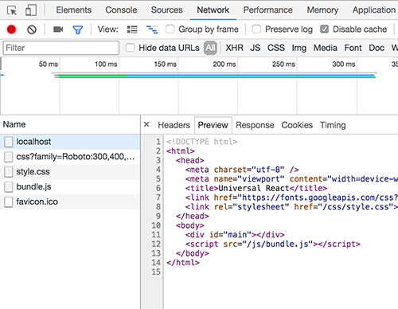

# Universal React Application
Great thanks to [Luciano Mammino](https://scotch.io/@loige) for the tutorial
[React on the Server for Beginners: Build a Universal React and Node App](https://scotch.io/tutorials/react-on-the-server-for-beginners-build-a-universal-react-and-node-app)

GitHub repository of this tutorial is available from this link [judo-heroes-2](https://github.com/lmammino/judo-heroes-2)

## What is universal JS ?
This is JavaScript which renders the same HTML whether on the server or on the client :)

### [Advantages](https://medium.com/commencis/isomorphic-universal-javascript-496dc8c4341a)
- Better performance
- Full SEO support
- Flexibility of client-side
- Maintenance
- Old device support
- Poor connections
- Better user experience

## Setup

```bash
git clone https://github.com/malik-aliyev-94/universal-react.git
cd universal-react
yarn # or `npm i` if you are not using yarn
```

## Available commands

Available commands to run with `npm run`:

 - `start`: build the production package and run the production server (no universal)
 - `start:universal`: build the production package and run the production server with universal rendering
 - `start:dev`: build the dev package and run the server in dev mode (no universal rendering — auto-restarts on changes)
 - `start:dev:universal`: build the dev package and run the server in dev mode with universal rendering (auto-restarts on changes)
 - `build`: build the production package
 - `build:dev`: build the dev package
 - `build:dev:watch`: build the dev package in watch mode (listen for changes and re-build immediately)

After starting you application you should see the Home page


You can test whether your application is universal or not - using [Postman](https://www.getpostman.com/) or Chrome Dev Tools.

First toggle DEV TOOLS and go to **Network** tab then reload the page. You should see all requests in the left pane. Preview your first request (to localhost:port, DOC type).
If you see only layout of your application (empty #main div) - this is not universal JS application.

### Not Universal


### Universal


You can watch this [YouTube video](https://youtu.be/Bi7cxUYrcSo) for a clever understanding.

As a state manager - [MobX](https://mobx.js.org/getting-started.html) included.
In IndexPage component MobX store is assigned to the window.store variable, so you can test store from console.

Open your console (Dev Tools) and run:

```javascript
store.title = "Changed title"
```

If the subtitle under "Home page" is changed from "Universal React" to "Changed title" - MobX is working :)

As a css preprocessor - [Stylus](stylus-lang.com) included (./src/static/css/style.styl)

### React Router Tip
If you are using arrow based react components - pass them as **render** parameter to the Route.

```javaScript
<Route exact path="/" render={renderIndex} />
```

If you are using class based react components (extends React.Component ) - pass them as **component** parameter to the Route.

```javaScript
<Route exact path="/info" component={InfoPage} />
```
